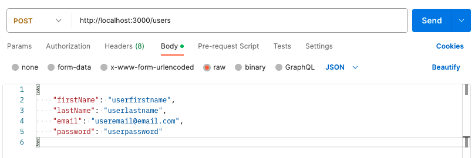
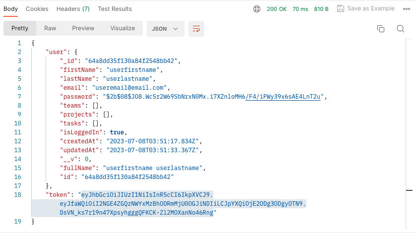
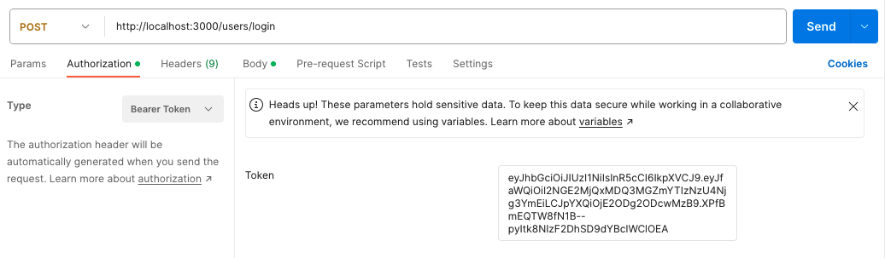
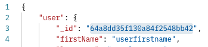

# Dock it - a productivity app

Bring your projects to shore.   
*or*   
Power up your projects.  

Dock it is a project management app for both inidviduals and teams. With the Dock it API, users have the ability to: 
- create and manage personal projects 
- create and manage teams and team projects
- create and manage project tasks

## Table of Contents
- [Technologies Used](#technologies-used)
- [Installation](#installation) 
    - [Prerequisites](#prerequisites)
    - [Cloning the Repository](#cloning-the-repository)
    - [Setup](#setup)
- [Usage](#usage)
    - [Starting the App in Dev Mode](#starting-the-app-in-dev-mode)
    - [Starting the App Without Dev Mode](#starting-the-app-without-dev-mode)
    - [Making API Requests](#making-api-requests)
    - [Running Automated Testing](#running-automated-testing)
        - [Unit Testing](#unit-testing)
        - [Load Testing](#load-testing)
- [ER Diagrams](#er-diagram)
- [Wireframe Mockups](#wireframe-mockups)
    - [Personal Projects Dashboard](#personal-projects-dashboard)
    - [Team Projects Dashboard](#team-projects-dashboard)
    - [Team Details Page](#team-details-page)
- [Trello Board](#trello-board)

## Technologies Used
- JavaScript
- [Express](https://www.npmjs.com/package/express)
- [Mongoose](https://www.npmjs.com/package/mongoose)
- [Bcrypt](https://www.npmjs.com/package/bcrypt)
- [Dotenv](https://www.npmjs.com/package/dotenv)
- [JsonWebToken](https://www.npmjs.com/package/jsonwebtoken)
- [Morgan](https://www.npmjs.com/package/morgan)
- [Artillery](https://www.npmjs.com/package/artillery)
- [Jest](https://www.npmjs.com/package/jest)
- [SuperTest](https://www.npmjs.com/package/supertest)
- [MongoDB Memory Server](https://www.npmjs.com/package/mongodb-memory-server)

## Installation

### Prerequisites
Before attempting to install the Dock it API, please ensure you have the following installed on your computer. 
- [Node.js](https://nodejs.org/en)
- [nodemon](https://www.npmjs.com/package/nodemon) - *global installation recommended*

The following are programs are also recommended, but not required. Alternatives are available, but these will be used in the guide below. 
- [Visual Studio Code](https://code.visualstudio.com/)
- [Postman](https://www.postman.com/) - *desktop app recommended*

### Cloning the Repository
1. Clone this repository by clicking the green [<> Code] button and copying the SSH URL. 

    

2. Using the terminal, navgate to the directory where you want to store the cloned directory.
3.  In your terminal, enter the command `git clone` and paste the copied the SSH URL.  

    ```
    git clone git@github.com:hlysllrs/unit-2-project.git
    ```
    
4. Enter the command `code .` to open the newly cloned directory in VS Code.

### Setup
After installation, please follow the below steps to ensure proper setup for using the Dock it API.
1. Open the VS Code terminal and enter the command `npm install -y` to install the required packages. 
2. Create a `.env` file containing the following variables: 
    - `MONGO_URI` - a MongoDB connection string for connecting to your database
    - `PORT` - the designated port number to be used for server connection
    - `SECRET_KEY` - a secret code for encoding sensitive information   
    
    Example:
    ``` 
    MONGO_URI=mongodb+srv://<username>:<password>@cluster0.ugyvtst.mongodb.net/<database-name>?retryWrites=true&w=majority
    PORT=3000
    SECRET_KEY=<insert-secret-code-here>
    ```
    <sup>*NOTE: The information inside angled brackets `< >` should be replaced with your information. The final MongoDB connection string and secret code will not contain any angled brackets.*</sup>
## Usage

### Starting the App in Dev Mode
To start the app in development mode, enter the following command into the VS Code Terminal:
```
npm run dev
```
Once the server and database connections are made, the terminal should read: 
```
Taking a trip to Port 3000!
All aboard the Mongo Express!
```

### Starting the App Without Dev Mode
To start the app without dev mode, enter the following command into the VS Code Terminal:
```
npm start
```
Once the server and database connections are made, the terminal should read: 
```
Taking a trip to Port 3000!
All aboard the Mongo Express!
```

### Making API Requests
Once the server is running successfully, API requests can be made using Postman.  
In Postman, create a new workspace to begin making HTTP requests. In a new request tab, enter the the URL `http://localhost:3000`. This will be the start of the URL for all of the possible requests listed below. When making requests, add on the endpoint listed for the request at the end of the URL: 
```
http://localhost:3000/users
```
<sup>*NOTE: If you entered a different port number in you `.env` file, replace 3000 in the URL with the port number entered.*</sup>

For each request below, an HTTP request type is llisted. Please make sure to select the indicated request type using the dropdown menu in Postman before sending the request. 

All request data must be sent using JSON format. To do so, sleect the "Body" tab under the URL bar, and check the "RAW" radio button. Then, select "JSON" from the drop down menu on to the right of the radio buttons. 

#### Create a User  
HTTP request type: `POST`  
Endpoint: `/users`  
Request data: 
- firstName: (*required*) new user's first name
- lastName: (*required*) new user's last name
- email: (*required*) new user's email address
- password: (*required*) new user's password - *must be at least 8 characters*

In Postman, this request will look like: 



Press the "Send" button to send the request.

#### Login a User  
HTTP request type: `POST`  
Endpoint: `/users/login`  
Request data:   
- email: (*required*) user's email address
- password: (*required*) user's password

*NOTE*: Once a user is loggd in, a token will be returned with the login request response. All requests after this point will require the user to be logged in and have authorization.  
To send a request with user authorization, first copy the token returned in login request's response.  

  

Then, in the "Authorization" tab under the URL bar, select "Bearer Token" from the dropdown menu and paste the copied token into the "Token" text box.  




#### Logout a User  
HTTP request type: `POST`  
Endpoint: `/users/logout`  
Request data: none

#### Update a User's Information
HTTP request type: `PUT`  
Endpoint: `/users/:userId`  
Request data: 
- firstName: (*required*) user's first name
- lastName: (*required*) user's last name
- email: (*required*) user's email address
- password: (*required*) user's password - must be at least 8 characters

*NOTE*: `:userId` will be replaced with the `_id` of the user  

 

#### Show a User's Information 
HTTP request type: `GET`   
Endpoint: `/users/:userId`   
Request data: none

#### Delete a User
HTTP request type: `DELETE`   
Endpoint: `/users/:userId`   
Request data: none

<sup>*NOTE*: Deleting a user also deletes all of their personal projects and tasks. It also removes the user reference from any teams, team projects, or tasks they were assigned to.</sup>

#### Create a Team
HTTP request type: `POST`  
Endpoint: `/teams`  
Request data: 
- title: (*required*) title of the team
- description: description of the team

<sup>*NOTE*: The user will automatically be assigned to an admin role for the team created.</sup>

#### Add a Member to the Team
HTTP request type: `PUT`  
Endpoint: `/teams/add/:teamId`  
Request data: 
- member: (*required*) id of the user being added as a member to the team
- role: (*required*) desired role for the new member  
    - must be either 'admin' or 'contributor'

<sup>*NOTE*: The user must be a team admin to perform this request.</sup>

#### Remove a Member from the Team
HTTP request type: `PUT`  
Endpoint: `/teams/remove/:teamId`  
Request data: 
- member: (*required*) id of the user being removed as a member of the team

<sup>*NOTE*: The user must be a team admin to perform this request.</sup>

#### Update a Team's Information
HTTP request type: `PUT`  
Endpoint: `/teams/:teamId`  
Request data: 
- title: title of the team
- description: description of the team

<sup>*NOTE*: The user must be a team admin to perform this request.</sup>

#### Delete a Team
HTTP request type: `DELETE`  
Endpoint: `/teams/:teamId`  
Request data: none

<sup>*NOTE*: The user must be a team admin to perform this request.</sup>   
<sup>*NOTE*: Deleting a team also removes the team reference from any users it was assigned to and deletes associated projects, and tasks for those projects.</sup>

#### Show a Team's Information
HTTP request type: `GET`  
Endpoint: `/teams/:teamId`  
Request data: none

<sup>*NOTE*: The user must be a team member to perform this request.</sup>

#### Create a Project 
HTTP request type: `POST`  
Endpoint: `/projects`  
Request data: 
- title: (*required*) title of the project
- description: description of the project
- type: (*required*) type of project  
    - must be either 'personal' or 'team'
- startDate: start date of the project  
    - defaults to date the project was created
- endDate: (*required*) end date of the project
- team: id of the team the project is assigned to (only if project type is 'team')

<sup>*NOTE*: For team projects, the user must be a team admin to perform this request.</sup>  
<sup>*NOTE*: The user will automatically be assigned to an admin role for the project created.</sup>

#### Add a Member to a Team Project
HTTP request type: `PUT`  
Endpoint: `/projects/add/:projectId`  
Request data: 
- member: (*required*) id of the user being added as a member to the project
- role: (*required*) desired role for the new member  
    - must be either 'admin' or 'contributor'

<sup>*NOTE*: The user must be a project admin to perform this request.</sup>

#### Remove a Member from a Team Project
HTTP request type: `PUT`  
Endpoint: `/projects/remove/:projectId`  
Request data: 
- member: (*required*) id of the user being removed as a member of the project

<sup>*NOTE*: The user must be a project admin to perform this request.</sup>

#### Update a Project's Information
HTTP request type: `PUT`  
Endpoint: `/projects/:projectId`  
Request data: 
- title: title of the project
- description: description of the project
- startDate: start date of the project
- endDate: end date of the project

<sup>*NOTE*: The user must be a project admin to perform this request.</sup>

#### Delete a Project
HTTP request type: `DELETE`  
Endpoint: `/projects/:projectId`  
Request data: none

<sup>*NOTE*: The user must be a project admin to perform this request.</sup>  
<sup>*NOTE*: Deleting a project also removes the project reference from any teams or users it was assigned to and deletes associated tasks.</sup>

#### Show a Project
HTTP request type: `GET`  
Endpoint: `/projects/:projectId`  
Request data: none

<sup>*NOTE*: The user must be a project member to perform this request.</sup>

#### Show all of a Team's Projects
HTTP request type: `GET`  
Endpoint: `/teams/:teamId/projects`  
Request data: none

<sup>*NOTE*: The user must be a team member to perform this request.</sup>

#### Show all of the User's Personal Projects
HTTP request type: `GET`  
Endpoint: `/projects`  
Request data: none

#### Show all of the User's Teams and Team Projects
HTTP request type: `GET`  
Endpoint: `/teams`  
Request data: none

<sup>*NOTE*: The user must be a team member to perform this request.</sup>

#### Create a Task
HTTP request type: `POST`  
Endpoint: `/projects/:projectId/tasks`  
Request data: 
- title: (*required*) title of the task  
- dueDate: due date of the task    
    - defaults to date the task was created
- project: (*required*) id of the project the task is assigned to  
- assignedTo: id of the user the task is assigned to  
    - assinged user must be a member of the project  
- status: current status of the task  
    - defaults to 'Not Started'
    - must be either 'Not Started', 'In Progress', or 'Complete'

<sup>*NOTE*: The user must be a project admin to perform this request.</sup>

#### Reassign a Task
HTTP request type: `PUT`  
Endpoint: `/projects/:projectId/tasks/reassign/:taskId`  
Request data: 
- assignedTo: id of the user the task is assigned to  
    - assinged user must be a member of the project

<sup>*NOTE*: The user must be a project admin to perform this request.</sup>

#### Update a Task's Details
HTTP request type: `PUT`  
Endpoint: `/projects/:projectId/tasks/:taskId`  
Request data: 
- title: title of the task
- dueDate: due date of the task
- completion status of the task
    - must be either 'Not Started', 'In Progress', or 'Complete'

<sup>*NOTE*: The user must be a project admin to perform this request.</sup>

#### Update a Task's Status
HTTP request type: `PUT`  
Endpoint: `/projects/:projectId/tasks/status/:taskId`  
Request data: 
- completion status of the task
    - must be either 'Not Started', 'In Progress', or 'Complete'

<sup>*NOTE*: The user must be the person assigned to the task to perform this request.</sup>

#### Delete a Task
HTTP request type: `DELETE`  
Endpoint: `/projects/:projectId/tasks/:taskId`  
Request data: none

<sup>*NOTE*: The user must be a project admin to perform this request.</sup>

### Running Automated Testing
#### Unit Testing
To run automated unit testing, enter the following command into the VS Code Terminal:
```
npm run test
```

#### Load Testing
To run automated load testing, first you will need to [start the app in dev mode](#starting-the-app-in-dev-mode). Then, in your computer's terminal application (*not the VS Code terminal*), navigate to the app's cloned repository and run the following command: 
```
npm run load
```


## ER Diagram


## Wireframe Mockups
### Personal Projects Dashboard

### Team Projects Dashboard

### Team Details Page


## Trello Board
[Click here](https://trello.com/invite/b/WVUtxERw/ATTI8845271994a647d62d21ac2e8b3b3b672C9026CA/api-project) to view current progress on implemented user stories and app features.