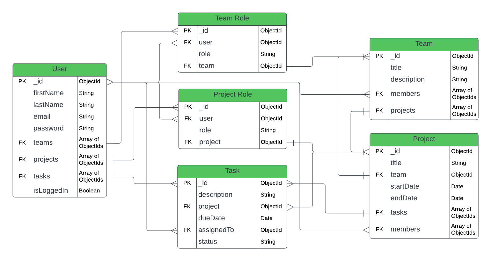
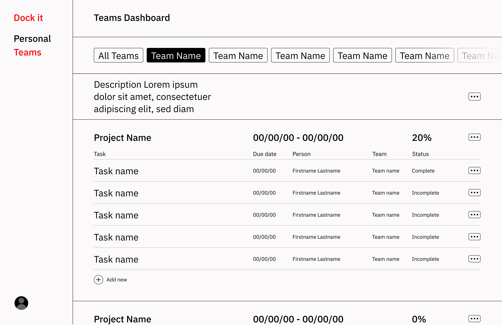
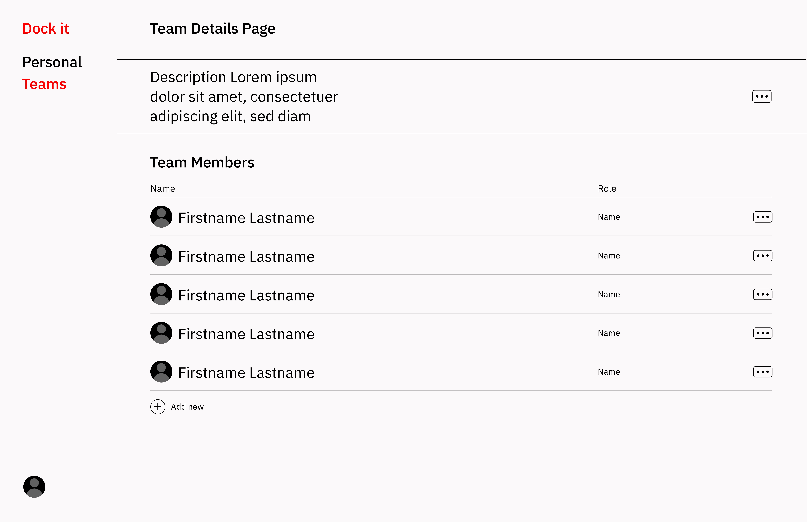

# Dock it - a productivity API

Bring your projects to shore.   
*or*   
Power up your projects.  

Dock it is a project management app for both inidviduals and teams. With the Dock it API, users have the ability to: 
- create and manage personal projects 
- create and manage teams and team projects
- create and manage project tasks

## Table of Contents
- [Technologies Used](#technologies-used)
- [Installation](#installation) 
    - [Prerequisites](#prerequisites)
    - [Cloning the Repository](#cloning-the-repository)
    - [Setup](#setup)
- [Usage](#usage)
    - [Starting the App in Dev Mode](#starting-the-app-in-dev-mode)
    - [Making API Requests](#making-api-requests)
    - [Running Automated Testing](#running-automated-testing)
        - [Unit Testing](#unit-testing)
        - [Load Testing](#load-testing)
    - [Starting the App Without Dev Mode](#starting-the-app-without-dev-mode)
- [ER Diagrams](#er-diagram)
- [Wireframe Mockups](#wireframe-mockups)
    - [Personal Projects Dashboard](#personal-projects-dashboard)
    - [Team Projects Dashboard](#team-projects-dashboard)
    - [Team Details Page](#team-details-page)
- [Trello Board](#trello-board)

## Technologies Used
- JavaScript
- [Express](https://www.npmjs.com/package/express)
- [Mongoose](https://www.npmjs.com/package/mongoose)
- [Bcrypt](https://www.npmjs.com/package/bcrypt)
- [Dotenv](https://www.npmjs.com/package/dotenv)
- [JsonWebToken](https://www.npmjs.com/package/jsonwebtoken)
- [Morgan](https://www.npmjs.com/package/morgan)
- [Artillery](https://www.npmjs.com/package/artillery)
- [Jest](https://www.npmjs.com/package/jest)
- [SuperTest](https://www.npmjs.com/package/supertest)
- [MongoDB Memory Server](https://www.npmjs.com/package/mongodb-memory-server)

## Installation

### Prerequisites
Before attempting to install the Dock it API, please ensure you have the following installed on your computer. 
- [Node.js](https://nodejs.org/en)
- [nodemon](https://www.npmjs.com/package/nodemon) - *global installation recommended*

The following are programs are also recommended, but not required. Alternatives are available, but these will be used in the guide below. 
- [Visual Studio Code](https://code.visualstudio.com/)
- [Postman](https://www.postman.com/) - *desktop app recommended*

### Cloning the Repository
1. Clone this repository by clicking the green [<> Code] button and copying the SSH URL. 
    
2. Using the terminal, navgate to the directory where you want to store the cloned directory.
3.  In your terminal, enter the command `git clone` and paste the copied the SSH URL.
    ```
    git clone git@github.com:hlysllrs/unit-2-project.git
    ```
4. Enter the command `code .` to open the newly cloned directory in VS Code.

### Setup
After installation, please follow the below steps to ensure proper setup for using the Dock it API.
1. Open the VS Code terminal and enter the command `npm install -y` to install the required packages. 
2. Create a `.env` file containing the following variables: 
    - `MONGO_URI` - a MongoDB connection string for connecting to your database
    - `PORT` - the designated port number to be used for server connection
    - `SECRET_KEY` - a secret code for encoding sensitive information   
    
    Example:
    ``` 
    MONGO_URI=mongodb+srv://<username>:<password>@cluster0.ugyvtst.mongodb.net/<database-name>?retryWrites=true&w=majority
    PORT=3000
    SECRET_KEY=<insert-secret-code-here>
    ```
    *Please note: The information inside angled brackets `< >` should be replaced with your information. The final MongoDB connection string and secret code will not contain any angled brackets.*
## Usage

### Starting the App in Dev Mode
To start the app in development mode, enter the following command into the VS Code Terminal.
```
npm run dev
```
Once the server and database connections are made, the terminal should read: 
```
Taking a trip to Port 3000!
All aboard the Mongo Express!
```

### Making API Requests
How to make an api request in Postman (i.e what port, what url etc)

### Running Automated Testing
#### Unit Testing
To run automated unit testing, enter the following command into the VS Code Terminal.
```
npm run test
```

#### Load Testing
To run automated load testing, first you will need to [start the app in dev mode](#starting-the-app-in-dev-mode). Then, in your computer's terminal application (*not the VS Code terminal*), navigate to the app's cloned repository and run the following command: 
```
npm run load
```

### Starting the App Without Dev Mode
To start the app without dev mode, enter the following command into the VS Code Terminal.
```
npm start
```
Once the server and database connections are made, the terminal should read: 
```
Taking a trip to Port 3000!
All aboard the Mongo Express!
```


## ER Diagram


## Wireframe Mockups
### Personal Projects Dashboard

### Team Projects Dashboard

### Team Details Page


## Trello Board
[Click here](https://trello.com/invite/b/WVUtxERw/ATTI8845271994a647d62d21ac2e8b3b3b672C9026CA/api-project) to view current progress on implemented user stories and app features.