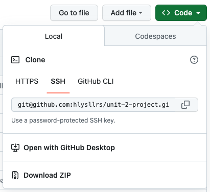

# Dock it - a productivity API

Bring your projects to shore. 

[ERD](https://lucid.app/lucidchart/9608d3bf-48f0-48d7-8039-934127a4c259/edit?viewport_loc=592%2C-348%2C1536%2C816%2C0_0&invitationId=inv_9a6898c5-0a6a-4ddc-b97d-f27a32c17481)  
[Trello Board](https://trello.com/invite/b/WVUtxERw/ATTI8845271994a647d62d21ac2e8b3b3b672C9026CA/api-project)

## Technologies Used

## Prerequisites
Before attempting to install the Dock it API, please ensure you have the following installed on your computer. 
- [Node.js](https://nodejs.org/en)
- [nodemon](https://www.npmjs.com/package/nodemon) - global installation recommended

The following are programs are also recommended, but not required. Alternatives are available, but these will be used in the guide below. 
- [Visual Studio Code](https://code.visualstudio.com/)
- [Postman](https://www.postman.com/) - desktop app recommended

## Installing the Application
1. Clone this repository by clicking the green [<> Code] button and copying the SSH URL. 
    
2. Using the terminal, navgate to the directory where you want to store the cloned directory.
3.  In your terminal, enter the command `git clone` and paste the copied the SSH URL.
    ```
    git clone git@github.com:hlysllrs/unit-2-project.git
    ```
4. Enter the command `code .` to open the newly cloned directory in VS Code.

## Getting Started
After installation, please follow the below steps to ensure proper setup for using the Dock it API.
1. Open the VS code terminal and enter the command `npm i` to install the required packages. 
2. Create a `.env` file containing the following variables: 
    - `MONGO_URI` - a MongoDB connection string for connecting to your database
    - `PORT` - the designated port number to be used for server connection
    - `SECRET_KEY` - a secret code for encoding sensitive information
    ```
    // .env example
    MONGO_URI=mongodb+srv://<username>:<password>@cluster0.ugyvtst.mongodb.net/<database-name>?retryWrites=true&w=majority
    PORT=3000
    SECRET_KEY=<insert-secret-code-here>
    ```

## Running the Application
- clone repository
- must have node.js installed
- must have nodemon installed to use dev mode
- must create .env file containing the below information: 
    - `MONGO_URI` with MogngoDB connection string to connect to your database
    - `PORT` with designated port for server connection
    - `SECREY_KEY` with secret code for decoding JWTs and passwords
- install required packages by running `npm i` in teh terminal